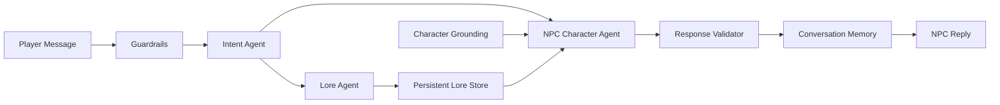

# Kharlroth2D

Kharlroth2D is a local-first browser RPG prototype built with Vite and Kaboom.

The frontend runs the maps, movement, scene transitions, welcome screen, music, and chat UI. The NPC intelligence runs through a local Python backend that talks to Ollama on your own machine.

## Run The Game

Requirements:

- Node.js + npm
- Python with the packages in `requirements.txt`
- Ollama installed and running locally
- Ollama models:
  - `phi3.5` for character responses and lore generation
  - `qwen2.5:1.5b` for intent classification and light utility tasks

Install dependencies:

```bash
npm install
python -m pip install -r requirements.txt
```

Start Ollama if it is not already running:

```bash
ollama serve
```

Install the local models if needed:

```bash
ollama pull phi3.5
ollama pull qwen2.5:1.5b
```

Start the AI backend:

```bash
npm run ai:dev
```

Start the game on the port used during local testing:

```bash
npm run dev -- --host 127.0.0.1 --port 4173
```

Open:

```text
http://127.0.0.1:4173
```

If you run only `npm run dev`, Vite may use its default port instead. Use the URL printed in that terminal.

## Build

```bash
npm run build
```

## Current Scenes

Registered playable scenes:

- `welcome`
- `home`
- `midgard`
- `northmidgard`
- `nidavellir`

Current main navigation flow:

```text
welcome -> home -> midgard -> northmidgard -> nidavellir
```

Current return flow:

```text
nidavellir -> midgard
northmidgard -> midgard
midgard -> home
```

Current map data files:

- `public/home.json`
- `public/midgard.json`
- `public/northmidgard.json`
- `public/nidavellir.json`
- `public/jormungandr.json`

`jormungandr.json` is present as map data, but it is not registered as a playable scene yet.

## AI Architecture

The game uses a local Python dialogue pipeline in `python_ai/`. The browser talks to this backend through the Vite proxy at `/api/ai`.

Main pieces:

- `python_ai/app.py`: FastAPI entrypoint for `/api/ai/health`, `/api/ai/ready`, and `/api/ai/chat`
- `python_ai/service.py`: conversation service, Ollama bridge, state tracking, guardrails, and pipeline integration
- `python_ai/character_data.py`: character specs and RAG-style retrieval packs for major NPCs
- `src/ai/conversationOrchestrator.js`: browser-side client for the Python backend
- `src/ai/sceneConversationRuntime.js`: scene chat wiring and NPC contact behavior
- `src/ai/npcRegistry.js`: frontend NPC placement and trigger metadata

Active AI characters:

- `Yrsa` in `home`, bound to the `Yrsa` map boundary
- `Eirik` in `midgard`, bound to the `eirik` map boundary
- `Styrbjorn` in `northmidgard`, bound to the `Styrbjorn` map boundary

High-level AI chat pipeline:



Pipeline steps:

- `Player Message`: the player types a message in the NPC chat window.
- `Guardrails`: the system checks for modern topics, cheating, prompt injection, or hidden-system requests.
- `Intent Agent`: the message is classified into a purpose, such as lore, directions, quest guidance, small talk, or goodbye.
- `Character Grounding`: each NPC has private grounding that defines who they are, what they know, what they do not know, and how they speak.
- `NPC Character Agent`: the response is generated in the selected character's voice using the current scene, intent, memory, and grounding.
- `Lore Agent`: lore questions are routed through a lore system so the game can reuse known lore or generate new lore only when needed.
- `Persistent Lore Store`: generated lore is saved so future conversations stay consistent.
- `Response Validator`: the reply is checked before display to keep it safe, in-world, and character-appropriate.
- `Conversation Memory`: recent turns are stored so the NPC can keep context during the current session.
- `NPC Reply`: the final response appears in the chat window.

## Intent System

Every player message is classified before an NPC response is generated.

Modules:

- `python_ai/intent_classifier.py`
- `python_ai/intent_router.py`
- `python_ai/npc_response_orchestrator.py`

Supported intents:

- `ask_world_info`
- `ask_character_info`
- `ask_quest_guidance`
- `ask_direction`
- `ask_lore`
- `small_talk`
- `goodbye`
- `unknown`

Intent flow:

1. Player message reaches `/api/ai/chat`
2. Regex guardrails run first
3. `IntentClassifier` asks Ollama for strict JSON intent output
4. JSON is validated
5. If invalid, the classifier retries once
6. If still invalid, keyword rules classify the message
7. Local overrides correct obvious cases like `who are you?`, `where should I go?`, and `do you know a wise man?`
8. `IntentRouter` maps the intent to the correct handler
9. `NpcResponseOrchestrator` adds response focus and lore requirements
10. The character reply is generated from character spec, scene context, recent memory, intent, and optional lore

Example classifier output:

```json
{
  "intent": "ask_lore",
  "confidence": 0.91,
  "entities": {
    "topic": "Fenrir",
    "target_person": null,
    "target_place": null
  }
}
```

## Dynamic Lore System

Lore is generated only when needed, stored, and reused across later conversations.

Modules:

- `python_ai/lore_store.py`
- `python_ai/lore_retriever.py`
- `python_ai/lore_generator.py`
- `python_ai/lore_manager.py`

Persistent store:

- `python_ai/data/lore_store.json`

Supported lore types:

- `myth_fragment`
- `rumor`
- `historical_note`
- `relic_description`
- `location_legend`
- `character_rumor`

Lore flow:

1. Intent is classified as `ask_lore`
2. Topic is extracted from intent entities
3. `LoreRetriever` searches stored lore by topic, tags, and keyword overlap
4. If a good match exists, that lore entry is reused
5. If no match exists, `LoreGenerator` asks Ollama for strict JSON lore
6. Lore JSON is validated
7. If invalid, generation retries once
8. If generation still fails, a safe fallback lore entry is returned
9. New lore is stored and reused on later interactions

Canon constraints used by the lore generator:

- Kharlroth is the main hero
- Yrsa is his wife and first guide
- Fenrir spreads fear and despair across Midgard
- Kharlroth must recover relics
- Eirik is a farmer
- Styrbjorn is a wise elder in North Midgard
- The Eye of Odin is in Yggdrasil's roots guarded by Nidhoggr

## Example Flows

Eirik directional guidance:

```text
Player: Do you know a wise man?
Intent: ask_direction
Result: Eirik points Kharlroth toward Styrbjorn in North Midgard.
```

Yrsa lore generation and reuse:

```text
Player: What do you know about Fenrir?
Intent: ask_lore
Result: the lore store is checked first. Existing Fenrir lore is reused; otherwise new lore is generated and persisted.
```

Eirik knowledge limits:

```text
Player: What do you know about relics?
Intent: ask_lore
Result: Eirik admits relic lore is beyond him and points toward Styrbjorn.
```

## Local Models

Default model mapping is configured in `python_ai/service.py` and can be overridden with environment variables.

Defaults:

- `KHARLROTH_OLLAMA_MODEL=phi3.5`
- `KHARLROTH_OLLAMA_ROUTER_MODEL=qwen2.5:1.5b`
- `KHARLROTH_OLLAMA_GUARDRAIL_MODEL=qwen2.5:1.5b`
- `KHARLROTH_OLLAMA_VALIDATOR_MODEL=qwen2.5:1.5b`
- `KHARLROTH_OLLAMA_MEMORY_MODEL=qwen2.5:1.5b`
- `KHARLROTH_OLLAMA_RESPONDER_FAST_MODEL=phi3.5`
- `KHARLROTH_OLLAMA_RESPONDER_SLOW_MODEL=phi3.5`
- `KHARLROTH_OLLAMA_TUNER_MODEL=phi3.5`

Optional model-side guardrail, router, and validator overrides are disabled by default because the local utility model can be overzealous. The regex guardrail and deterministic intent overrides remain active.

## Logging

Debug logs are written as JSONL files in:

- `python_ai/logs/`

Current log streams include:

- `intent_classifier`
- `lore_generator`
- `lore_manager`
- `npc_response_orchestrator`

## Smoke Tests

Run the local smoke tests:

```bash
python -m python_ai.smoke_tests
```

They cover:

- fallback intent classification
- JSON validation for intent payloads
- lore generation vs reuse behavior
- basic router/orchestrator integration

## Repository Notes

- `backups/` is intentionally left local and untracked.
- `dist/` is generated build output and ignored by git.
- Active gameplay chat goes through the Python backend. The frontend only keeps the browser client, scene runtime, local transcript state, and NPC registry needed for gameplay.
